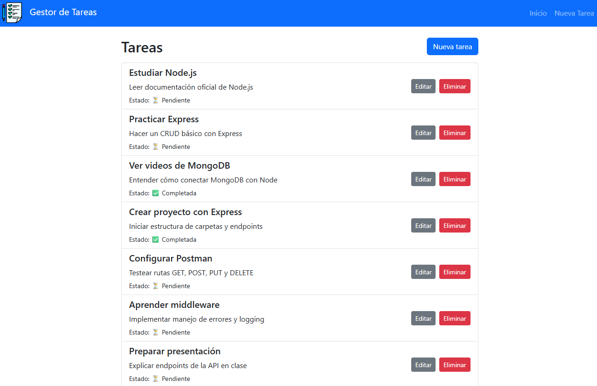

# 📝 Gestor de Tareas - ChallengeAcademiaForIT



> Aplicación web fullstack para la gestión de tareas, desarrollada con **Node.js + Express** en el backend y **React + Bootstrap** en el frontend para el challenge de ingreso de Academia ForIT.

---

## 📋 Descripción

Este proyecto permite a los usuarios crear, editar, listar y eliminar tareas de forma sencilla. La aplicación funciona completamente en el navegador y utiliza un almacenamiento en memoria en el backend como ejemplo de implementación.

---

## 🚀 Tecnologías utilizadas

### 🖥️ Frontend
- React
- React Router DOM
- Bootstrap 5
- Vite (como bundler)

### 🛠️ Backend
- Node.js
- Express.js
- CORS
- UUID (para generación de IDs únicos)

---

## 📂 Estructura del proyecto

ChallengeAcademiaForIT/

backend/ # Servidor Express con API REST
    routes/
    index.js
    ...

frontend/ # Aplicación React con Vite
    src/
        components/
        pages/
        ...
    
---

## ⚙️ Cómo ejecutar el proyecto localmente

### ✅ Requisitos previos

- Node.js y npm instalados

---

### 🔌 Paso 1: Clonar el repositorio

```bash
git clone https://github.com/tu-usuario/gestor-de-tareas.git
cd gestor-de-tareas
```

---

### 📦 Paso 2: Configurar el backend

```bash
cd backend
npm install
npm run dev
```

El backend se ejecutará por defecto en http://localhost:3000

---

### 💻 Paso 3: Configurar el frontend

```bash
cd ../frontend/challenge_frontend
npm install
```

Crear archivo .env en la carpeta frontend
VITE_API_URL=http://localhost:3000/api

Ejecutar el frontend
```bash
npm run dev
```

---

### 🧪 Funcionalidades

- ✅ Listado de tareas

- ✍️ Crear nuevas tareas

- 🛠️ Editar tareas existentes

- 🗑️ Eliminar tareas

- 🔁 Feedback inmediato sin recargar la página

- 🎨 Diseño responsive con Bootstrap

- 🔒 Manejo básico de errores

- 🎉 Alertas modernas con SweetAlert2

---

### 📌 Notas

- El backend usa almacenamiento en memoria, por lo tanto las tareas se reinician al reiniciar el servidor.

- Ideal para prácticas de desarrollo fullstack o proyectos educativos.

---

### 📬 Autor

- Fernando Blanco
- 📧 fernando.blanco004@gmail.com
- 💼 https://www.linkedin.com/in/fernando-blanco4/